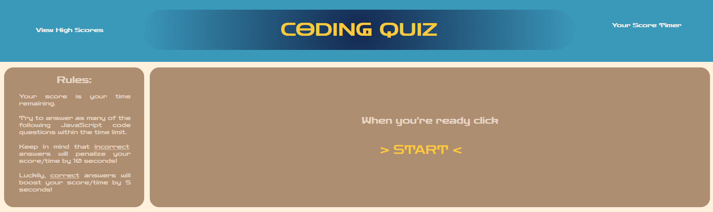

# MVR-bootcamp-challenge-4

## Coding Quiz Game
This repository is used to help quiz some JavaScript related terms and practices while demonstrating the use of JavaScript to make the website interactive and retain data on local storage of the player to show their scores over time.

## Usage
Upon loading up this repository in a web browser, the user will be presented with a title screen that shows teh rules and the greeting encouraging them to "start" the quiz. Upon taking teh quiz, the user/player will be run through a series of questions that test their knowledge with a timer countdown serving as their score to encourage quickness in testing.  Wrong answers will penalize the player's time but correct answers will boost it. Once teh quiz is completed or the timer reaches zero, the player will be presented with their scores and prompted to enter their initials to save it to the "Hall of Records" which can also be viewed from the title screen to show the history of the scores for players taking the quiz from the local storage.

[Deployed application](https://vrich88.github.io/MVR-bootcamp-challenge-4/)

## Future Improvements
This repository has a few issues that need to be returned to in the future to improve the functionality of the code; including:
    •Enhanced display of the High Scores to include a "rank"
    •Timer reset/stop doesn't fully stop the "background" running of timer and will trigger events at the time of "0" even if quiz is completed
    •General styling improvements to better enhance flow of quiz field

## Contributors
Consulting and guidance used in the creation of this repository include peers and resources (in no order) as follows:
    •Daniel Cohen
    •Matt Montiel
    •Justin Marchi
    •Lindsey Issac
    •Brian Hamlin

## License
MIT License

Copyright (c) 2023 vrich88

Permission is hereby granted, free of charge, to any person obtaining a copy
of this software and associated documentation files (the "Software"), to deal
in the Software without restriction, including without limitation the rights
to use, copy, modify, merge, publish, distribute, sublicense, and/or sell
copies of the Software, and to permit persons to whom the Software is
furnished to do so, subject to the following conditions:

The above copyright notice and this permission notice shall be included in all
copies or substantial portions of the Software.

THE SOFTWARE IS PROVIDED "AS IS", WITHOUT WARRANTY OF ANY KIND, EXPRESS OR
IMPLIED, INCLUDING BUT NOT LIMITED TO THE WARRANTIES OF MERCHANTABILITY,
FITNESS FOR A PARTICULAR PURPOSE AND NONINFRINGEMENT. IN NO EVENT SHALL THE
AUTHORS OR COPYRIGHT HOLDERS BE LIABLE FOR ANY CLAIM, DAMAGES OR OTHER
LIABILITY, WHETHER IN AN ACTION OF CONTRACT, TORT OR OTHERWISE, ARISING FROM,
OUT OF OR IN CONNECTION WITH THE SOFTWARE OR THE USE OR OTHER DEALINGS IN THE
SOFTWARE.
